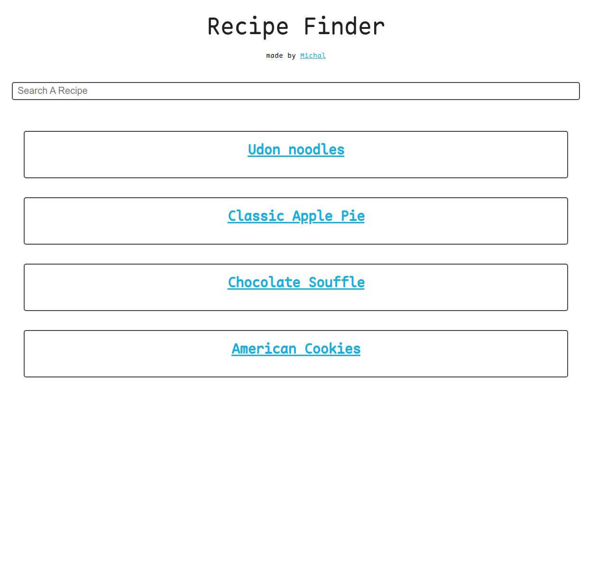

<h1 align="center" id="title">Recipe Finder</h1>

<p align="center"></p>

## 🚀 Demo

[Demo](https://recipefinder-1-n0420888.deta.app/)
## Description
This project is a recipe finder application that allows users to search for recipes in a simple and clean UI.

## Features
- Add a recipe
- Remove recipe
- Update recipe
- Search recipes
- See the recipie

## Installation
1. Clone the repository: 
````
git clone https://github.com/your-username/recipe-finder.git
````
2. Install the required dependencies: 
````
pip3 install -r requirements.txt 
````
3. Start the application: 
Dev:
````
python ./dev.py
````
Production
````
gunicorn main:app
````

## Screenshot



## Contributing
Contributions are welcome! If you would like to contribute to this project, please follow these steps:
1. Fork the repository.
2. Create a new branch: `git checkout -b feature/your-feature`
3. Make your changes and commit them: `git commit -m 'Add some feature'`
4. Push to the branch: `git push origin feature/your-feature`
5. Submit a pull request.

## License
This project is licensed under the [MIT License](https://opensource.org/license/mit).

## Contact
If you have any questions or suggestions, please feel free to contact us at kowal@outlook.dk
